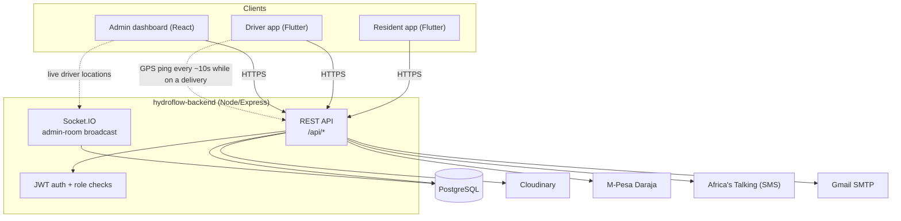
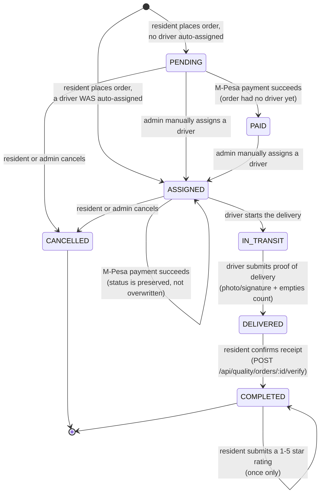
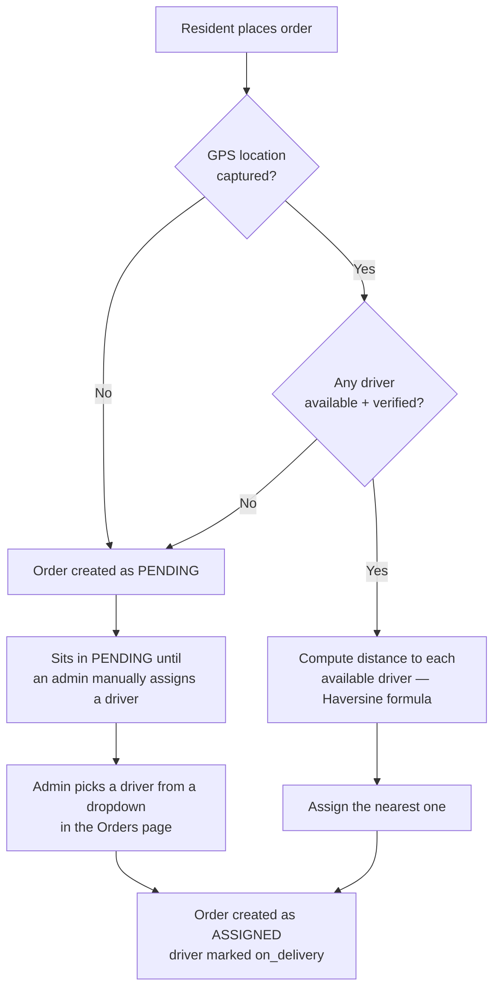
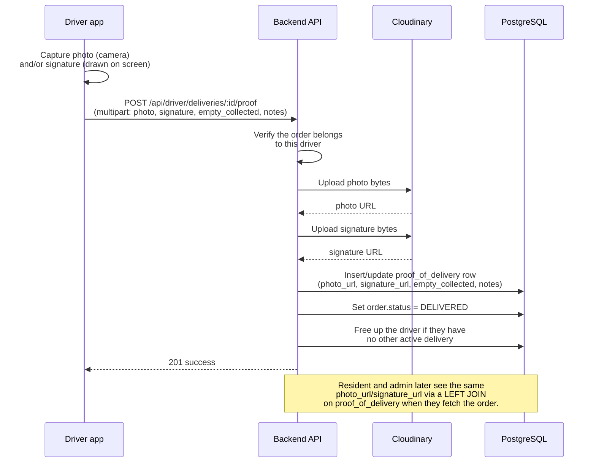
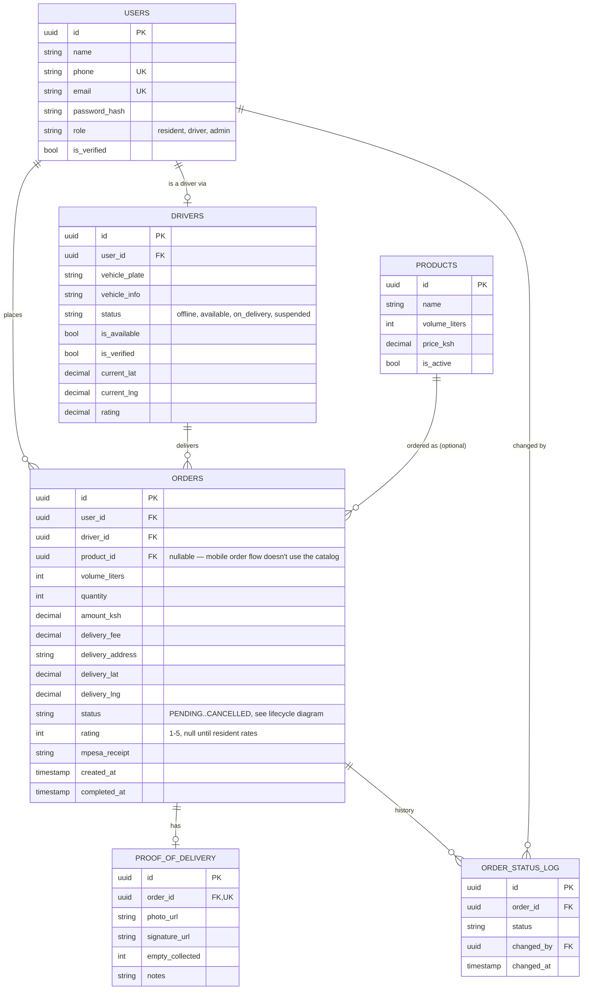

# Architecture

This explains how the system actually works today, based on reading the code — not how it was
originally planned. A few places where the real behavior has gaps or dead ends are called out
explicitly, because a new owner needs to know about those, not have them smoothed over.

## Contents
- [System overview](#system-overview)
- [Roles](#roles)
- [Order lifecycle](#order-lifecycle)
- [Driver assignment](#driver-assignment)
- [Proof of delivery](#proof-of-delivery)
- [Payments (M-Pesa)](#payments-m-pesa)
- [Data model](#data-model)
- [Third-party integrations](#third-party-integrations)

## System overview

All three client apps are "dumb" in the sense that none of them contain business logic beyond form
validation and display — every decision (who gets assigned a delivery, whether a rating is allowed,
whether a payment can be started) is made in the backend controllers.

Auth is a single JWT issued at login, containing the user's `id` and `role`. Every protected route
checks the token (`protect` middleware) and, where relevant, the role (`allowRoles('admin')` etc.).
There's no separate session store — the token itself is the credential, valid until it expires
(`JWT_EXPIRES_IN`, currently `7d`).

## Roles

There are exactly three roles, stored on the `users.role` column: `resident`, `driver`, `admin`.
The same login system serves all three — what differs is which app they use and which API routes
their JWT is allowed to call.

- **Resident** — mobile app only. Places orders, tracks them, pays, rates.
- **Driver** — mobile app (different screens, same app) or can also technically log into the admin
  dashboard (the frontend has a driver view for `/orders`, but it's mostly built around admin use).
- **Admin** — web dashboard only.

## Order lifecycle

Payment and driver assignment are two independent tracks that can happen in either order — a driver
can be auto-assigned before or after payment, and paying doesn't require a driver to exist yet (or
vice versa). Two things that made this correct, fixed after being caught during the initial
documentation pass:

1. **The M-Pesa endpoint now accepts payment on `PENDING` or `ASSIGNED` orders**, not just `PENDING`
   — it used to reject payment outright for any order that had already been auto-assigned a driver.
2. **The payment callback no longer overwrites delivery progress.** It used to unconditionally set
   `status = 'PAID'` on a successful payment — which, for an order that already had a driver
   (`ASSIGNED`/`IN_TRANSIT`), would have silently erased that assignment status and hidden the job
   from the driver's app. It now only moves `PENDING → PAID`; an already-assigned order keeps its
   real status and just gets `mpesa_receipt`/`paid_at` recorded. The admin dashboard's "Assign
   Driver" button also now appears for `PAID` orders, not just `PENDING` (the backend already
   supported this — only the button's visibility was missing it).

Cancellation is allowed from `PENDING` or `ASSIGNED` only (a resident can't cancel once a driver is
en route or has delivered).

## Driver assignment

A driver only shows up as a candidate for auto-assignment if **all** of these are true:
`is_available = true`, `is_verified = true` (an admin has to verify a driver at least once), and
they have a current GPS position on file (`current_lat`/`current_lng` not null — set by the driver
app pinging `PATCH /api/drivers/location` while online).

Once assigned, a driver is marked `on_delivery` and won't be offered new deliveries or show as
"available" until the current one reaches a terminal state (`DELIVERED`/`CANCELLED`), at which point
they're automatically flipped back to `available` — *unless* they have another active order, in which
case they stay `on_delivery`.

## Proof of delivery

Both the photo and signature are optional — the driver can submit with neither and the order still
gets marked `DELIVERED` (there's no server-side requirement that proof exists). Files are uploaded
straight from the backend (not directly from the phone to Cloudinary), so the Cloudinary API secret
never has to live inside the mobile app.

## Payments (M-Pesa)

The backend talks to Safaricom's **Daraja API**, currently configured for their **sandbox**
environment only — `MPESA_BASE_URL` is hardcoded to `https://sandbox.safaricom.co.ke` in
`mpesaService.js`. The `MPESA_ENVIRONMENT` variable in `.env` is not actually read anywhere; going
live would require changing that hardcoded URL (and getting production credentials from Safaricom),
not just flipping an env var.

Flow: resident places an order → mobile app calls `POST /api/mpesa/pay` → backend asks Safaricom to
send an STK push → mobile app polls `GET /api/mpesa/status/:orderId` every few seconds → when
Safaricom calls the backend back on `MPESA_CALLBACK_URL` with a result, the order flips to `PAID` (or
stays as-is on failure) → the poll picks up the new status and the app moves on.

In Safaricom's sandbox, no real phone receives a real prompt for arbitrary numbers — only their
shared test number (`254708374149`) is meaningful there, and even that mostly proves the request was
accepted rather than simulating a real customer PIN entry end-to-end. See
[SETUP.md](SETUP.md#common-setup-issues) for the practical implication.

## Data model

Only the fields that matter for understanding the system — not a full column dump (see the
migration files under `hydroflow-backend/src/migrations/` for the exact schema).

A few notes on things that look odd but are intentional (or at least, that's how the code treats
them):
- `orders.product_id` is almost always null in practice — the mobile order screen only ever creates
  10L/20L jerrican orders with a hardcoded price, and never references the `products` catalog table.
  The `products` table and its admin-only create/update API exist but aren't used by any part of the
  UI you can currently reach.
- `orders.rating` lives directly on the order row (one rating per order, resident → order only).
  There's no separate ratings table, and no driver-level aggregate rating is computed *from* order
  ratings — the `drivers.rating` column is a completely separate field that nothing currently writes
  to (it's always whatever it was set to at driver creation, i.e. `0`).
- `otp_codes` (not shown above) is a short-lived table for phone-login codes — rows are deleted as
  soon as they're used or replaced.

## Third-party integrations

| Service | What it's used for | Where it's called from |
|---|---|---|
| **Neon (PostgreSQL)** | The only database. Everything lives here. | `hydroflow-backend/src/config/db.js` |
| **Cloudinary** | Stores proof-of-delivery photos and customer signatures | `hydroflow-backend/src/config/cloudinary.js`, called from `driverSelfController.js` |
| **Safaricom M-Pesa (Daraja)** | STK Push payments | `hydroflow-backend/src/services/mpesaService.js` — sandbox only, see above |
| **Africa's Talking** | SMS for phone-login OTP codes | `hydroflow-backend/src/services/smsService.js` — degrades gracefully if not configured (still works for local dev, code just isn't texted) |
| **Gmail (SMTP via nodemailer)** | Account verification emails for the web dashboard's password-based signup | `hydroflow-backend/src/services/emailService.js` |
| **OpenStreetMap (via Leaflet / flutter_map)** | All maps, both admin dashboard and mobile — free, no API key needed | `react-leaflet` (web), `flutter_map` (mobile) |

Notably **not** integrated, despite being mentioned in older docs/env files: Google Maps (no API key
is read anywhere in the code), MongoDB, and anything IoT-related.
