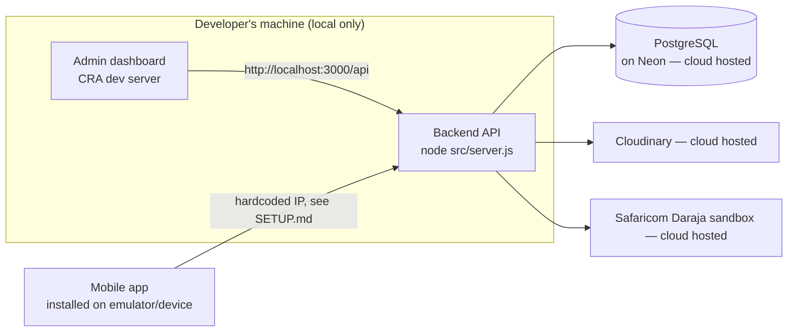

# Deployment

## The honest current state

**Nothing in this repo is currently deployed to production.** There's no `Dockerfile`, no
`render.yaml`/`vercel.json`/`fly.toml`/`Procfile`, no CI/CD pipeline (`.github/workflows` doesn't
exist), and the repo only has a single `main` branch with no `gh-pages` or deploy-related branches.
Everything described elsewhere in these docs — the backend, the admin dashboard, the mobile app —
has, as far as this repo shows, only ever been run locally on a developer's machine.

The **one exception** is the database: it already runs on [Neon](https://neon.tech), a managed cloud
Postgres provider, rather than on anyone's laptop. So today's real topology is:

This means: **if you want the admin dashboard or backend reachable by anyone other than someone
running it locally, that hosting still needs to be set up.** This document tells you what's involved
and gives sensible options — but none of it has been implemented or tested against a live deployment
as part of this handover.

## Getting each part hosted

None of these are prescriptive — they're reasonable, low-effort options for a project this size, not
a locked-in decision already made in the code.

### Backend API (`hydroflow-backend/`)

This is a standard Node/Express app with no unusual requirements — it needs: a Node 18+ runtime, the
environment variables listed in [SETUP.md](SETUP.md#environment-variables), and a public HTTPS URL
(the M-Pesa callback specifically requires this — see [ARCHITECTURE.md](ARCHITECTURE.md#payments-m-pesa)).
Platforms like **Render**, **Railway**, or a small VPS all work fine for this shape of app. Whichever
you pick, the deploy step is essentially: point it at this repo/subfolder, set the build command to
`npm install`, the start command to `node src/server.js` (or `npm start` if you add that script —
currently only `dev` exists, which uses `nodemon` and isn't meant for production), and fill in the
environment variables.

### Admin dashboard (`hydroflow-frontend/`)

This is a Create React App project — `npm run build` produces a static `build/` folder that can be
hosted anywhere that serves static files (**Vercel**, **Netlify**, **GitHub Pages**, or served by the
backend itself via `express.static`, though that's not currently wired up). It needs exactly one
environment variable at build time: `REACT_APP_API_URL`, pointing at wherever the backend ends up
hosted (e.g. `https://your-backend.onrender.com/api`).

### Mobile app (`hydroflow_mobile/`)

Flutter builds to an installable APK/AAB (Android) or IPA (iOS) — `flutter build apk` /
`flutter build ios`. Distribution (Play Store, TestFlight, or just sharing an APK) is a separate
decision from "deployment" in the web sense. The one thing that **must** happen before building for
real users: change the hardcoded backend URL in `lib/config/constants.dart` from a local IP to
wherever the backend is actually hosted publicly (see the mobile app section of [SETUP.md](SETUP.md)).

## Deploying updates

There's currently no automated deployment — no CI pipeline builds or ships anything on push. Shipping
a change today means, for whichever part changed: pull the latest code onto wherever it's hosted,
reinstall dependencies if `package.json`/`pubspec.yaml` changed, and restart the process (backend) or
rebuild (frontend static files, mobile app binary).

If you set up real hosting, it's worth adding a simple CI workflow (GitHub Actions is the natural fit
given the repo's already on GitHub) to automate this — that doesn't exist yet.

## Scheduled jobs / background services

**There are none.** The backend is a plain request/response Express server plus a Socket.IO layer for
live driver-location broadcasts to the admin dashboard — everything happens in response to an
incoming HTTP request or socket event. There's no cron job, no queue worker, no polling job running
inside the backend itself. (The mobile app does its own client-side polling — e.g. checking M-Pesa
payment status every few seconds — but that's the app asking the server, not the server doing
anything on a timer.)
