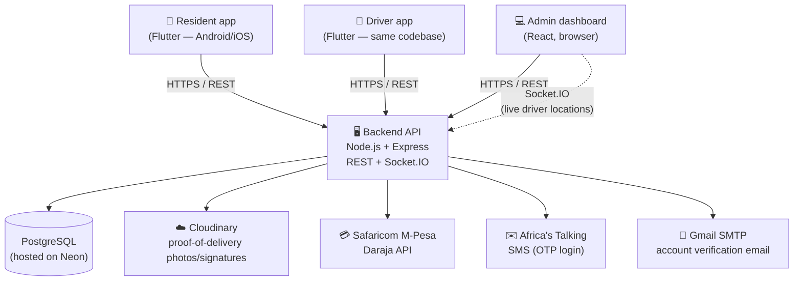

# HydroFlow — Water Delivery System

HydroFlow is a water delivery marketplace for Kenya. Residents order drinking water (in 10L or 20L
jerricans) from a mobile app; drivers see and fulfil those orders from the same app; admins manage
orders, drivers, and users from a web dashboard. Payment is by M-Pesa (mobile money).

This repo contains three applications that all talk to one shared backend:

| App | Who uses it | What they do |
|---|---|---|
| **Resident app** (mobile) | Customers | Place orders, track delivery live, pay by M-Pesa, rate their delivery |
| **Driver app** (mobile) | Delivery drivers | Go online/offline, see assigned deliveries, navigate, capture proof of delivery |
| **Admin dashboard** (web) | Staff/admins | See all orders, assign drivers, manage the driver fleet, view live driver locations on a map |

> **Note on scope:** an earlier version of this README (and `docs/API.md`, `docs/DATABASE_SCHEMA.md`,
> `docs/SPRINTS.md`) described a more ambitious original plan — IoT tank sensors, a "Predictive Thirst
> Engine", automated leak detection, MongoDB, a Python sensor simulator. **None of that was built.**
> The system that actually exists is the simpler, working water-delivery marketplace described in this
> document and the docs below. See [`HANDOVER_NOTES.md`](HANDOVER_NOTES.md) for more on this.

## How it fits together

Everything goes through the one backend — the two mobile apps and the web dashboard never talk to
each other directly, and none of them talk to Cloudinary/M-Pesa/etc. directly either (the backend is
the only thing holding those credentials).

## Tech stack

| Part | Stack |
|---|---|
| Backend API | Node.js, Express 5, PostgreSQL (via `pg`), JWT auth, Socket.IO |
| Admin dashboard | React 19 (Create React App), plain CSS (no UI framework), `axios`, `react-leaflet` for the live map |
| Resident + driver app | Flutter (Dart), single codebase, `provider` for state, `http` package for API calls |
| Database | PostgreSQL, currently hosted on [Neon](https://neon.tech) (serverless Postgres) |
| File storage | Cloudinary (proof-of-delivery photos and customer signatures) |
| Payments | Safaricom M-Pesa Daraja API (STK Push), currently wired to the **sandbox** environment only |
| SMS | Africa's Talking (OTP codes for phone login) |
| Email | Gmail SMTP via `nodemailer` (account verification emails for the web dashboard) |

## Where to go next

- **[SETUP.md](SETUP.md)** — get everything running on your own machine, step by step
- **[ARCHITECTURE.md](ARCHITECTURE.md)** — how the system actually works: order lifecycle, proof of
  delivery, driver assignment, data model
- **[DEPLOYMENT.md](DEPLOYMENT.md)** — how (and where) this is hosted today
- **[HANDOVER_NOTES.md](HANDOVER_NOTES.md)** — known rough edges, where the credentials live, and
  what to do first as the new owner
